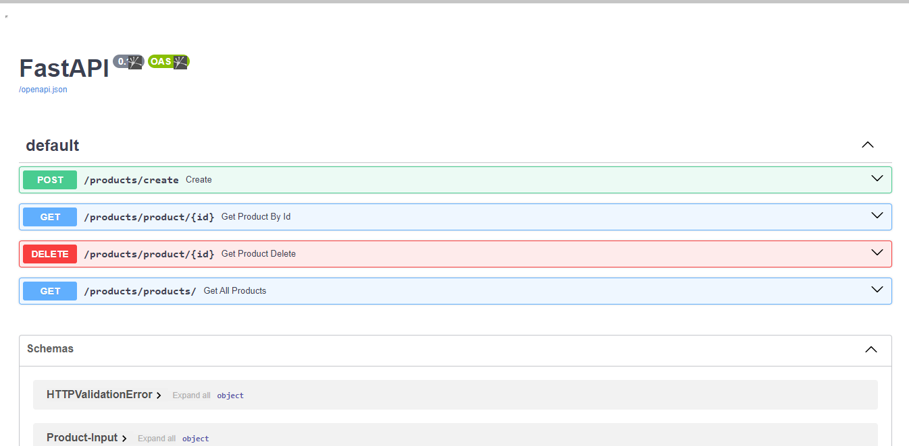

# Preview


# Proyecto CRUD con FastAPI y Redis

Este es un proyecto CRUD (Crear, Leer y Eliminar) simple desarrollado con FastAPI y utilizando Redis con ayuda de upstash como base de datos. Permite gestionar una lista de productos, incluyendo operaciones para crear, leer y eliminar productos.

## Configuración del Entorno

## Requisitos Previos

Asegúrate de tener instalado Python en tu sistema. Puedes descargarlo desde [python.org](https://www.python.org/downloads/).

### Instalación de Dependencias

```bash
pip install -r requirements.txt
```
## Creacion de Variables de Entorno para upstash

#### REDIS_HOST=""
#### REDIS_PORT=
#### REDIS_PASSWORD=""
#### REDIS_SSL=


## Ejecucion
```bash	
uvicorn main:app --reload --env-file=.env
```

